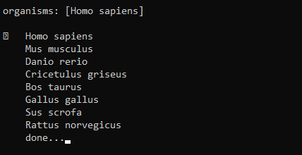
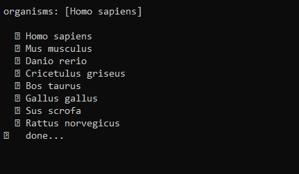

An example using the [`questionnaire`](https://github.com/kylebebak/questionnaire) module to collect gene symbols (and organisms) from the user (via command line) and then using NCBI's [eutils](https://www.ncbi.nlm.nih.gov/books/NBK25497/) to convert them to gene IDs.  This example is a little contrived, but it can be used as a starting point for more practical usage.  It's worth noting that the number of calls to `eutils` (per IP or API key) is limited by NCBI.  In the script, this is controlled via the `@limit_calls` decorator.

More examples of how to use `questionnaire` can be found on the GitHub page under `examples`.

# Installing
Set up a virtual environment and install requirments.
```
git clone https://github.com/mrperkett/example-ncbi-questionnaire.git example-ncbi-questionnaire
cd example-ncbi-questionnaire

virtualenv -p python3 questionnaire_env
. questionnaire_env/bin/activate
python3 -m pip install -r requirements.txt
```

# Running
```
python3 ./example_ncbi.py
```

# Testing
```
python3 -m unittest test.py
```

# Screenshots


Select organism



Select whether to select gene symbol as predefined.


Select predefined genes


Output


If we had instead selected `user-defined`


User enters custom gene symbols and then the output is printed.

